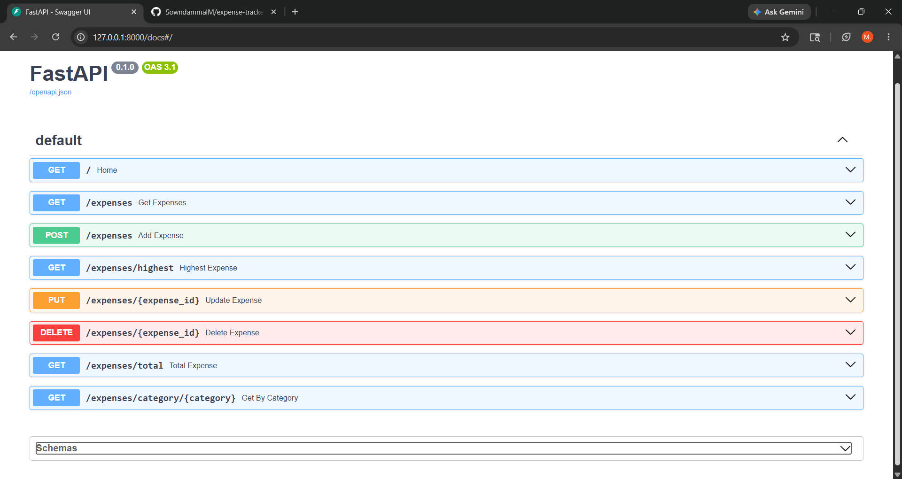
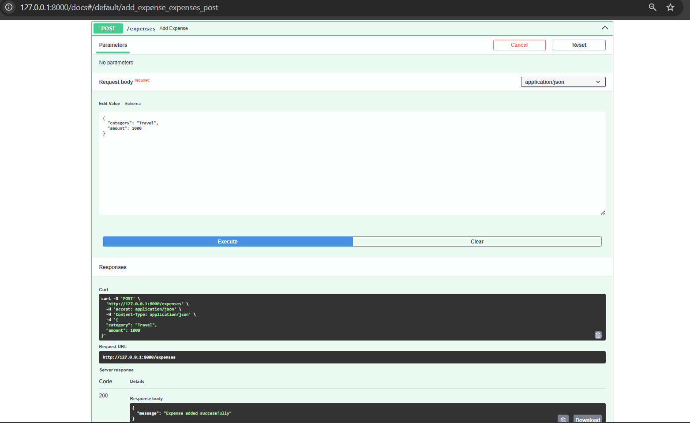

# Personal Expense Tracker API

A RESTful Expense Tracker API built using FastAPI, SQLite, and SQLAlchemy. This application allows users to manage daily expenses, calculate total spending, find the highest expense, and filter expenses by category.

## Features

- Add new expenses
- View all expenses
- Update existing expenses
- Delete expenses
- Get the highest expense
- Calculate total expenses
- Filter expenses by category
- SQLite database integration
- Swagger API documentation

## Technologies Used

- Python
- FastAPI
- SQLite
- SQLAlchemy
- Uvicorn
- Pydantic
- Swagger UI

## Project Structure

```text
expense-tracker-api/
│
├── main.py
├── database.py
├── models.py
├── schemas.py
├── expenses.db
├── requirements.txt
└── README.md
```

## Installation

### 1. Clone the Repository

```bash
git clone https://github.com/your-username/expense-tracker-api.git
cd expense-tracker-api
```

### 2. Create Virtual Environment

```bash
python -m venv venv
```

### 3. Activate Virtual Environment

#### Windows

```bash
venv\Scripts\activate
```

#### Linux/Mac

```bash
source venv/bin/activate
```

### 4. Install Dependencies

```bash
pip install -r requirements.txt
```

### 5. Run the Application

```bash
uvicorn main:app --reload
```

Server will start at:

```text
http://127.0.0.1:8000
```

## API Documentation

Swagger UI:

```text
http://127.0.0.1:8000/docs
```

ReDoc:

```text
http://127.0.0.1:8000/redoc
```

---

## API Endpoints

### Home

| Method | Endpoint | Description |
|----------|----------|----------|
| GET | / | API Status |

### Expense Management

| Method | Endpoint | Description |
|----------|----------|----------|
| POST | /expenses | Add Expense |
| GET | /expenses | Get All Expenses |
| PUT | /expenses/{id} | Update Expense |
| DELETE | /expenses/{id} | Delete Expense |

### Reports

| Method | Endpoint | Description |
|----------|----------|----------|
| GET | /expenses/highest | Get Highest Expense |
| GET | /expenses/total | Get Total Expenses |
| GET | /expenses/category/{category} | Filter By Category |

---

## Example Request

### Add Expense

**POST** `/expenses`

```json
{
  "category": "Food",
  "amount": 250
}
```

### Response

```json
{
  "message": "Expense added successfully"
}
```

---

## Sample Categories

- Food
- Travel
- Shopping
- Entertainment
- Education
- Health

---

## Learning Outcomes

This project helped me learn:

- Python Backend Development
- FastAPI Framework
- REST API Design
- CRUD Operations
- Database Integration
- SQLAlchemy ORM
- API Testing using Swagger UI
- Data Validation using Pydantic

---

## Future Enhancements

- User Authentication (JWT)
- Monthly Expense Reports
- Expense Charts and Analytics
- PostgreSQL Integration
- Docker Deployment
- Cloud Deployment

---

## Screenshots

### Swagger UI



### Add Expense API



### Get All Expenses API


## Author

**Sowndammal M**

M.Sc Computer Science Graduate

GitHub: https://github.com/SowndammalM